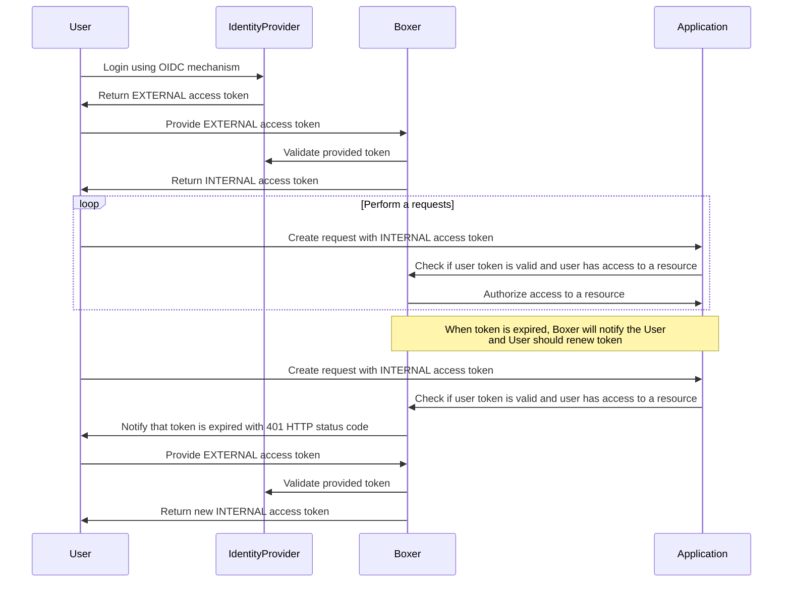

# Working with boxer as and API client

## Introduction

Boxer can be used to authenticate requests to an RESTful API using the token exchange mechanism based
on [Cedar security policy](https://cedarpolicy.com/).

This document describes how an HTTP client should behave to authenticate requests to an API using Boxer.

## The Authentication Flow

The authentication flow from the client application perspective is described in the following diagram:

The client application should follow the following steps to authenticate requests to an API using Boxer:

- The client application retrieves an external access token using the OIDC mechanism from an identity provider.
- The client application sends the external access token to Boxer to exchange it for an internal access token.
- The client application uses the internal access token to authenticate requests to the API. Note that the internal
  access token has a limited lifetime and will expire after a certain period of time. The indication of the expiration
  of the internal access token is done by returning a 401 HTTP status code from the API. When this happens, the client
  application should **repeat the process of retrieving an external access token and exchanging it for a new internal
  access token.**

## The internal access token usage and limitations

The internal access token can be used multiple times to authenticate requests to the API until it expires. It is
possible, but not recommended to issue a new internal access token for each request to the API.

The client application **should not** attempt to validate the internal access token itself or rely on the expiration
time of the internal access token.

The client application **should not** attempt to decode or parse the internal token content. The internal token
structure can be changed without any notification.

## Client libraries

The boxer token exchange mechanism is implemented in the following Ecco DataPlatform client libraries:

- [esd-services-api-client package for Python](https://github.com/SneaksAndData/esd-services-api-client)
- [esd-services-api-client-dotnet package for dotnet applications](https://github.com/SneaksAndData/esd-services-api-client-dotnet)